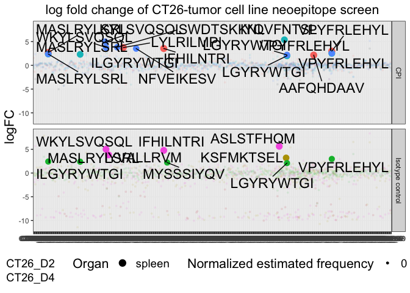
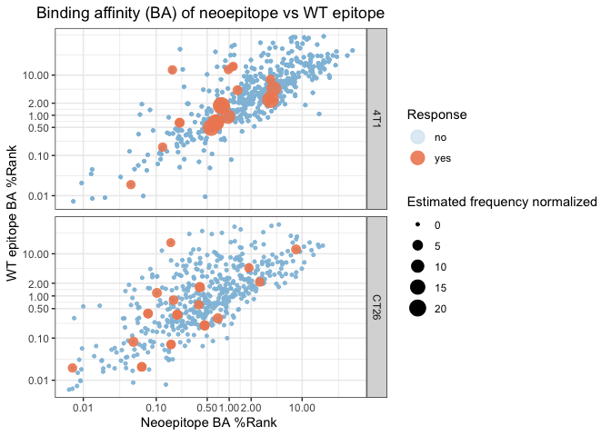
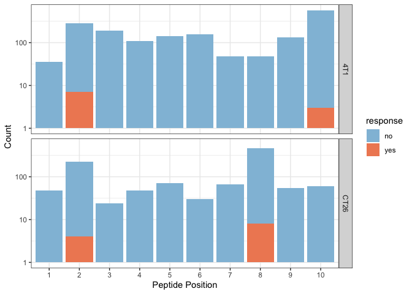
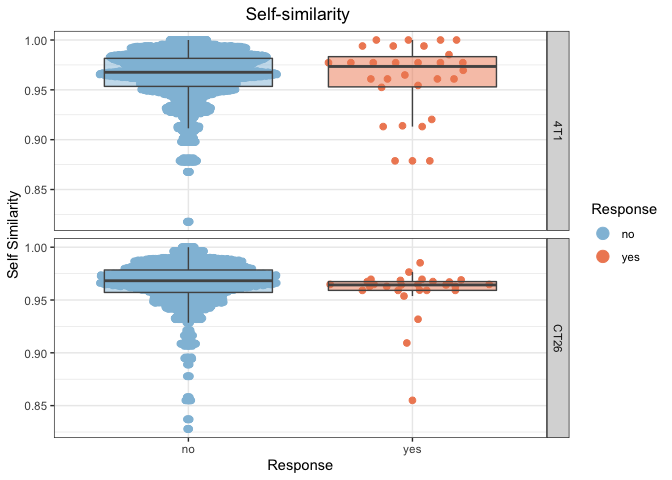

barcc
================

<!-- README.md is generated from the README.Rmd file. Edit that file for updates -->

## THIS PACKGAES IS IN BETA VERION\!

The packges will take pre-processed copy of raw baracoda files and
mupexi files and illustrate the characteristics of the immunugenic
neopeptides.

## Installation and background

The packges will take pre-processed copy of raw baracoda files and
mupexi files and illustrate the characteristics of the immunugenic
neopeptides. The packgaes works only with murine data, The human data
input is in progress …

``` r
# install.packages("devtools")
library(devtools)
devtools::install_github("rforbiodatascience/barcc")
```

barcc is built with [tidyverse](https://github.com/tidyverse/tidyverse)
and is required for running \#\# required packages

``` r
library(tidyverse)
library(readxl)
library(openxlsx)
library(shiny)
library(ggplot2)
library(barcc)
library(ggrepel)
library(ggbeeswarm)
```

# Load data

## Baracoda files

Baracoda files from experiment must be loaded

``` r
path_ct26 <- "test_data/barracoda_output_CT26.xlsx"
path_4t1 <- "test_data//barracoda_output_4T1.xlsx"
all_ct26_barracoda_raw <- path_ct26 %>% 
    # function to import all sheets
    excel_sheets() %>% 
    # give names to each sheet
    set_names() %>% 
    # apply read_excel to each sheet, and add the number to the colum sheet
    map_df(~ read_excel(path = path_ct26, sheet = .x), .id = "sheet") 
  
all_4t1_barracoda_raw <- path_4t1 %>% 
    excel_sheets() %>% 
    set_names() %>% 
    map_df(~ read_excel(path = path_4t1, sheet = .x), .id = "sheet")
```

## Mupexi files

Load all mupexi files
and

``` r
mupexi_ct26 <- read_xlsx(path = "test_data/ct26_library_mupexi.xlsx") %>% 
  # remove extra columns from previous handling
  select(-identifier, -Mut_peptide.y, -Allele) %>% 
  # convert Mut_MHCrank_EL and Expression level to numeric so we can join both files
  mutate(Mut_MHCrank_EL = as.numeric(Mut_MHCrank_EL),
         Expression_Level = as.numeric(Expression_Level))

mupexi_4t1 <- read_xlsx(path = "test_data/4T1_library_mupexi.xlsx") %>% 
  select(-identifier)
```

## PE population info and buffycoat HLA info file

``` r
sample_info <- read_xlsx(path = "test_data/sample_info.xlsx")
buffycoat.HLA_info <- read_xlsx(path = "test_data/buffycoatHLA_info.xlsx")
```

## Merge all baracoda files

``` r
all_barracoda <- full_join(all_ct26_barracoda_raw, all_4t1_barracoda_raw)
```

## Merge mupexi files

``` r
all_mupexi <- full_join(mupexi_4t1, mupexi_ct26) 
```

## Merge data function

Use merge function to merge baracoda and mupexi files the output is
my\_data

``` r
my_data <- merge_all_data(all_barracoda =  all_barracoda,
                           all_mupexi  = all_mupexi,
                          sample_info = sample_info,
                          buffycoat.HLA_info  = buffycoat.HLA_info)
```

## Clean data function

with clean data function the varribale is cleaned and reay to import in
augment\_data fundtion

``` r
my_clean_data <- clean_data(my_data)
```

## Augment data

This function will make new column esimated frequency from the baracaoda
screening

``` r
my_clean_augment_data <- augment_data(my_clean_data)
```

# Plotting functions

Firstly the responses can be explored in the following function, where
the cell line and data is selcted

``` r
 barc_resp(data = my_clean_augment_data,
           Cell_Line = "CT26") +
  labs(title = "log fold change of CT26-tumor cell line neoepitope screen")
```

<!-- -->

To look closer to responses and discover the distribution of Imporved
Binder (IB) and Conserved Binder (CB), the scatter plot funtion can be
used.

``` r
scatterplot_function(data = my_clean_augment_data,
                           x = 'mut_mhcrank_ba', 
                           y= 'norm_mhcrank_ba')+
  labs(title= "Binding affinity (BA) of neoepitope vs WT epitope",
       x= "Neoepitope BA %Rank ",
       y="WT epitope BA %Rank")
```

<!-- -->

To investegate the muations possition in missense mutations the bar plot
function is constructed

``` r
bar_plot_func(data = my_clean_augment_data,
                    pep_length = 10)
```

<!-- -->

To see wheter the is a diffrence in the responses and non responses to
diffrent varraible the box plot function can be used

``` r
box_function(data = my_clean_augment_data, 
                   x = 'response',
                   y= 'self_similarity') +
  labs(title = "Self-similarity ", 
       x = "Response", 
       y = "Self Similarity",
       color = "Response")
```

<!-- -->

# Explore data in shiny app

Tha data can easy be open in a shiny app to explore the responses and
the if tehre is and pattern in the immunugenic
neoepitopes

``` r
Exploring_data_shiny(Plotting_data = my_clean_augment_data )
```

<!--html_preserve-->

<div class="muted well" style="width: 100% ; height: 400px ; text-align: center; box-sizing: border-box; -moz-box-sizing: border-box; -webkit-box-sizing: border-box;">

Shiny applications not supported in static R Markdown documents

</div>

<!--/html_preserve-->
