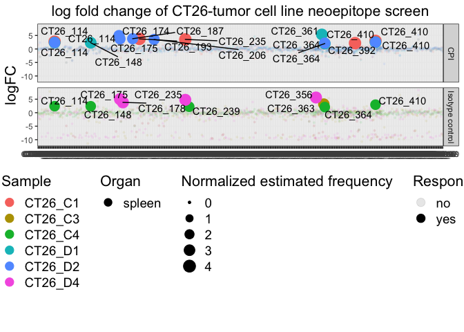
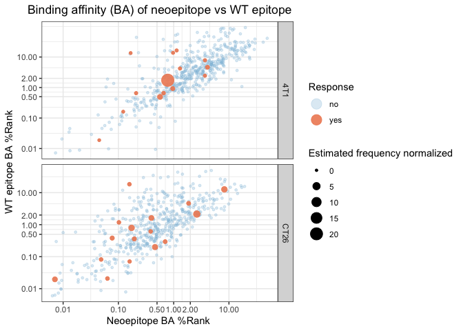
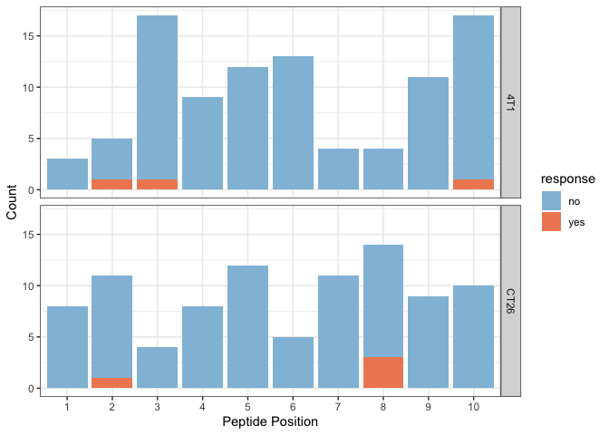
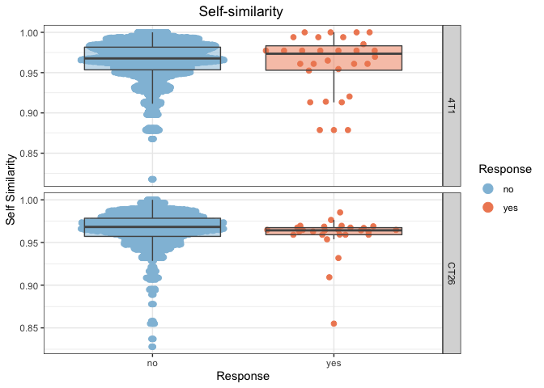

barcc
================

<!-- README.md is generated from the README.Rmd file. Edit that file for updates -->
THIS PACKGAES IS IN BETA VERION!
--------------------------------

The packges will take pre-processed copy of raw baracoda files and mupexi files and illustrate the characteristics of the immunugenic neopeptides.

Installation and background
---------------------------

The packges will take pre-processed copy of raw baracoda files and mupexi files and illustrate the characteristics of the immunugenic neopeptides. The packgaes works only with murine data, The human data input is in progress ...

``` r
# install.packages("devtools")
library(devtools)
#devtools::install_github("rforbiodatascience/barcc")
library(barcc)
```

barcc is built with [tidyverse](https://github.com/tidyverse/tidyverse) and is required for running \#\# required packages

``` r
library(tidyverse)
library(readxl)
library(openxlsx)
library(shiny)
library(ggplot2)
library(barcc)
library(ggrepel)
library(ggbeeswarm)
library(knitr)
```

Load data
=========

Baracoda files
--------------

Baracoda files from experiment must be loaded

``` r
path_ct26 <- "test_data/barracoda_output_CT26.xlsx"
path_4t1 <- "test_data//barracoda_output_4T1.xlsx"
all_ct26_barracoda_raw <- path_ct26 %>% 
    # function to import all sheets
    excel_sheets() %>% 
    # give names to each sheet
    set_names() %>% 
    # apply read_excel to each sheet, and add the number to the colum sheet
    map_df(~ read_excel(path = path_ct26, sheet = .x), .id = "sheet") 
  
all_4t1_barracoda_raw <- path_4t1 %>% 
    excel_sheets() %>% 
    set_names() %>% 
    map_df(~ read_excel(path = path_4t1, sheet = .x), .id = "sheet")
kable(head(all_4t1_barracoda_raw))
```

| sheet       | barcode | sample     |  count.1|  input.1|  input.2|  input.3|  log\_fold\_change|          p|  -log10(p)|  masked\_p (p = 1 if logFC &lt; 0)|  -log10(masked\_p)|  count.normalised (edgeR)|  input.normalised (edgeR)| Peptide.name | HLA   | Sequence    |
|:------------|:--------|:-----------|--------:|--------:|--------:|--------:|------------------:|----------:|----------:|----------------------------------:|------------------:|-------------------------:|-------------------------:|:-------------|:------|:------------|
| X4T1\_16.TU | A10B200 | 4T1\_16-TU |        4|      256|      306|      243|          -1.302920|  0.2192027|  0.6591540|                          1.0000000|            0.00000|                 0.0112809|                 0.0278560| 4T1\_1       | H-2Db | KTVFNSRFL   |
| X4T1\_16.TU | A15B201 | 4T1\_16-TU |        0|       81|      105|       83|          -9.088002|  0.0115297|  1.9381811|                          1.0000000|            0.00000|                 0.0000000|                 0.0093040| 4T1\_10      | H-2Db | STSIGSSTPM  |
| X4T1\_16.TU | A18B203 | 4T1\_16-TU |        7|       43|       59|       47|           1.615952|  0.0897883|  1.0467802|                          0.0897883|            1.04678|                 0.0364584|                 0.0118618| 4T1\_100     | H-2Kd | AYVKKFSYQSI |
| X4T1\_16.TU | A18B205 | 4T1\_16-TU |        0|       61|       66|       52|          -8.507643|  0.0439994|  1.3565535|                          1.0000000|            0.00000|                 0.0000000|                 0.0142728| 4T1\_101     | H-2Kd | KYIIQAGQV   |
| X4T1\_16.TU | A18B204 | 4T1\_16-TU |        0|       36|       31|       39|          -7.767225|  0.0713457|  1.1466323|                          1.0000000|            0.00000|                 0.0000000|                 0.0085468| 4T1\_102     | H-2Kd | EYLTAKNMKL  |
| X4T1\_16.TU | A18B206 | 4T1\_16-TU |        2|       79|      121|      115|          -1.269234|  0.3793029|  0.4210138|                          1.0000000|            0.00000|                 0.0104167|                 0.0251642| 4T1\_103     | H-2Kd | YYFTMAQQP   |

Mupexi files
------------

Load all mupexi files

``` r
mupexi_ct26 <- read_xlsx(path = "test_data/ct26_library_mupexi.xlsx") %>% 
  # remove extra columns from previous handling
  select(-identifier, -Mut_peptide.y, -Allele) %>% 
  # convert Mut_MHCrank_EL and Expression level to numeric so we can join both files
  mutate(Mut_MHCrank_EL = as.numeric(Mut_MHCrank_EL),
         Expression_Level = as.numeric(Expression_Level))

mupexi_4t1 <- read_xlsx(path = "test_data/4T1_library_mupexi.xlsx") %>% 
  select(-identifier)
kable(head(mupexi_4t1))
```

| HLA\_allele | Norm\_peptide | Norm\_MHCrank\_EL | Norm\_MHCscore\_EL | Norm\_MHCaffinity | Norm\_MHCrank\_BA | Norm\_MHCscore\_BA | Mut\_peptide |  Mut\_MHCrank\_EL| Mut\_MHCscore\_EL | Mut\_MHCaffinity | Mut\_MHCrank\_BA | Mut\_MHCscore\_BA | Gene\_ID              | Transcript\_ID                              | Amino\_Acid\_Change | Allele\_Frequency | Mismatches | peptide\_position | Chr | Genomic\_Position | Protein\_position | Mutation\_Consequence | Gene\_Symbol | Cancer\_Driver\_Gene | Proteome\_Peptide\_Match |  Expression\_Level| Mutant\_affinity\_score | Normal\_affinity\_score | Expression\_score  | priority\_Score | Self\_Similarity |
|:------------|:--------------|:------------------|:-------------------|:------------------|:------------------|:-------------------|:-------------|-----------------:|:------------------|:-----------------|:-----------------|:------------------|:----------------------|:--------------------------------------------|:--------------------|:------------------|:-----------|:------------------|:----|:------------------|:------------------|:----------------------|:-------------|:---------------------|:-------------------------|------------------:|:------------------------|:------------------------|:-------------------|:----------------|:-----------------|
| H2-Dd       | SPPRFFHM      | 0.0082            | 0.624879           | 491.4             | 0.0452            | 0.427228           | SPPRFFYM     |            0.0084| 0.616375          | 143.6            | 0.0132           | 0.540915          | MGP\_BALBcJ\_G0024183 | MGP\_BALBcJ\_T0049114,MGP\_BALBcJ\_T0049115 | H/Y                 | 0.525             | 1          | 7                 | 18  | 29046509          | 13,13             | M                     | Wdr33        | -                    | No                       |         22.3967509| 0.9999526549055792      | 0.9999527022247707      | 1.0                | 26              | 0.963257         |
| H2-Kb       | IAYAYTGNL     | 0.0077            | 0.973579           | 2.8               | 0.0072            | 0.903204           | IAYAYRGNL    |            0.0091| 0.968819          | 2.9              | 0.0073           | 0.901354          | MGP\_BALBcJ\_G0030762 | MGP\_BALBcJ\_T0077749,MGP\_BALBcJ\_T0077750 | T/R                 | 0.179             | 1          | 6                 | 6   | 54019866          | 91,91             | M                     | Kbtbd2       | -                    | No                       |         25.1951836| 0.9999524889153081      | 0.9999528203159544      | 1.0                | 9               | 0.951350         |
| H2-Db       | TAIINHPLL     | 0.0053            | 0.959733           | 21.7              | 0.0098            | 0.7156             | TGIINHPLL    |            0.0111| 0.911029          | 132.9            | 0.0664           | 0.548069          | MGP\_BALBcJ\_G0025205 | MGP\_BALBcJ\_T0052051                       | A/G                 | 0.500             | 1          | 2                 | 19  | 45414840          | 15                | M                     | Cfap43       | -                    | No                       |         44.9245980| 0.9999520114438829      | 0.9999533830625381      | 1.0                | 25              | 0.974213         |
| H2-Kd       | SYTAPNTIF     | 0.1807            | 0.502292           | 1298.5            | 1.0411            | 0.337423           | SYTAPNTIL    |            0.0129| 0.871451          | 45.5             | 0.0598           | 0.647101          | MGP\_BALBcJ\_G0026922 | MGP\_BALBcJ\_T0059497,MGP\_BALBcJ\_T0059498 | F/L                 | 0.346             | 1          | 9                 | 2   | 171540148         | 269,215           | M                     | Gcnt7        | -                    | No                       |          0.1187235| 0.9999515776185053      | 0.9998879552318652      | 0.215301102252408  | 4               | 0.985810         |
| H2-Kb       | HMFLFARL      | 0.0064            | 0.978047           | 3.4               | 0.0085            | 0.885905           | HMFLFGRL     |            0.0203| 0.94733           | 5.9              | 0.0133           | 0.836579          | MGP\_BALBcJ\_G0026916 | MGP\_BALBcJ\_T0059483                       | A/G                 | 0.467             | 1          | 6                 | 2   | 171330471         | 214               | M                     | Mc3r         | -                    | No                       |          0.1588522| 0.9999497525243818      | 0.9999531259750578      | 0.2532216695531489 | 6               | 0.965400         |
| H2-Dd       | AGFSSFQKI     | 0.0881            | 0.371051           | 12894.2           | 2.6668            | 0.125256           | AGFSSFQKL    |            0.0267| 0.465965          | 10559.4          | 1.8413           | 0.143719          | MGP\_BALBcJ\_G0031040 | MGP\_BALBcJ\_T0079002                       | I/L                 | 0.483             | 1          | 9                 | 6   | 90823751          | 1826              | M                     | Adamts9      | -                    | No                       |          2.3905895| 0.9999481186865968      | 0.9999294769199811      | 0.9863617148770685 | 24              | 0.992681         |

Sample information file
-----------------------

``` r
sample_info <- read_xlsx(path = "test_data/sample_info.xlsx")
kable(head(sample_info))
```

| sample   |  percent\_PE|
|:---------|------------:|
| CT26\_C1 |         4.23|
| CT26\_C3 |         3.41|
| CT26\_C4 |         2.79|
| CT26\_D1 |         3.64|
| CT26\_D2 |         3.22|
| CT26\_D4 |         3.84|

Merge all baracoda files
------------------------

``` r
all_barracoda <- full_join(all_ct26_barracoda_raw, all_4t1_barracoda_raw)
```

Merge mupexi files
------------------

``` r
all_mupexi <- full_join(mupexi_4t1, mupexi_ct26) 
```

Merge data function
-------------------

Use merge function to merge baracoda and mupexi files the output is my\_data

``` r
my_data <- merge_all_data(barracoda =  all_barracoda,
                          mupexi  = all_mupexi,
                          info = sample_info)
```

Clean data function
-------------------

With clean data function the varribale is cleaned and ready to import in augment\_data function

``` r
my_clean_data <- clean_data(my_data)
```

Augment data
------------

This Augment function will make new column with esimated frequency from the barracoda screening

``` r
my_clean_augment_data <- augment_data(my_clean_data)
```

Plotting functions
==================

Firstly the responses can be explored in the following function, where the cell line and data is selected

``` r
 barc_resp(data = my_clean_augment_data,
           mouse_cell_line = "CT26") +
  labs(title = "log fold change of CT26-tumor cell line neoepitope screen")
```



To look closer to responses and discover the distribution of Imporved Binder (IB) and Conserved Binder (CB), the scatter plot funtion can be used.

``` r
scatterplot_function(data = my_clean_augment_data,
                           x = 'mut_mhcrank_ba', 
                           y= 'norm_mhcrank_ba')+
  labs(title= "Binding affinity (BA) of neoepitope vs WT epitope",
       x= "Neoepitope BA %Rank ",
       y="WT epitope BA %Rank")
```



To investegate the muations possition in missense mutations the bar plot function is constructed

``` r
bar_plot_func(data = my_clean_augment_data,
                    pep_length = 10)
```



To see wheter the is a diffrence in the responses and non responses to diffrent varraible the box plot function can be used

``` r
box_function(data = my_clean_augment_data, 
                   x = 'response',
                   y= 'self_similarity') +
  labs(title = "Self-similarity ", 
       x = "Response", 
       y = "Self Similarity",
       color = "Response")
```



Explore data in shiny app
=========================

Tha data can easy be open in a shiny app to explore the responses and the if there is and pattern in the immunugenic neoepitopes in [Shiny\_exploring](https://annie-borch.shinyapps.io/exploring_data/) Or with the following function in Rstudio.

``` r
Exploring_data_shiny(Plotting_data = my_clean_augment_data )
```

<!--html_preserve-->
Shiny applications not supported in static R Markdown documents

<!--/html_preserve-->
